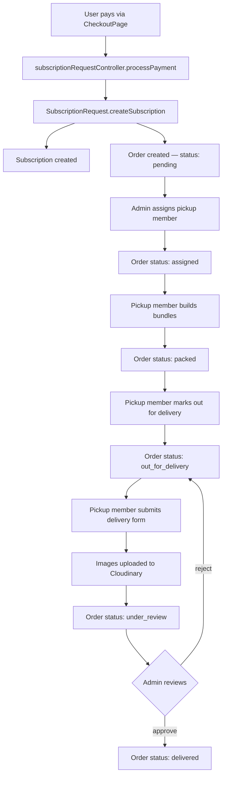
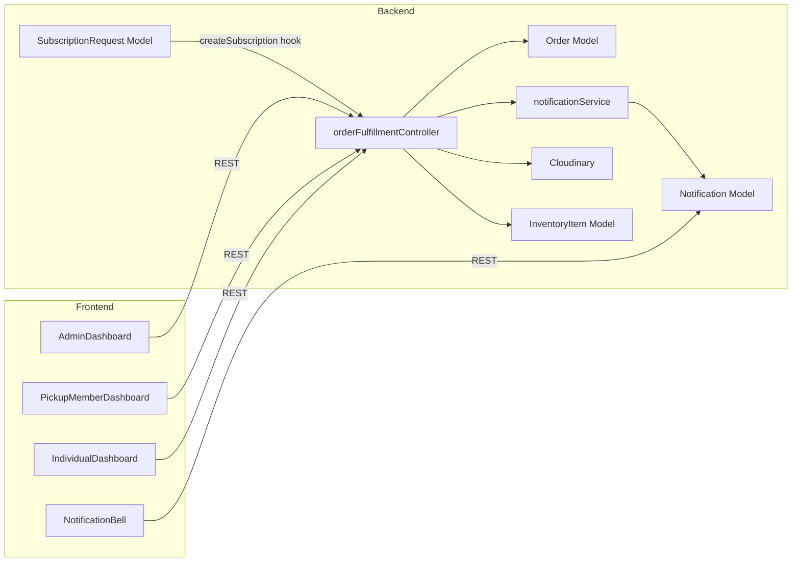
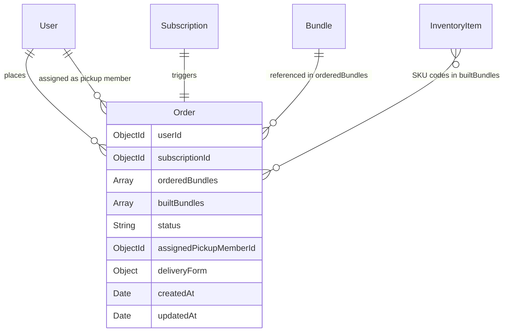

# Design Document: Subscription Order Fulfillment

## Overview

This feature introduces a complete order fulfillment pipeline for individual subscribers on the ClosetRush platform. An `Order` document is created automatically when a `SubscriptionRequest` transitions to `subscription_created`, and it travels through a six-stage lifecycle (`pending → assigned → packed → out_for_delivery → under_review → delivered`) managed by admins and pickup members.

The design adds:
- A new `Order` Mongoose model
- A `BUNDLE_ID_FORMAT` server-side constant for configurable Bundle ID generation
- A new `orderFulfillmentController.js` with all lifecycle endpoints
- A new `routes/orderRoutes.js` file registered in `server.js`
- An integration hook inside `SubscriptionRequest.createSubscription()` to auto-create the Order
- A new `Notification` Mongoose model and `notificationService.js` for in-app notifications
- A `NotificationBell` UI component in the Navbar for all authenticated roles
- Frontend additions to `PickupMemberDashboard`, `AdminDashboard`, and `IndividualDashboard`
- In-app notification triggers at every status transition (no email)

---

## Architecture



### Component Interaction



---

## Components and Interfaces

### 1. `models/Order.js` — New Mongoose Model

The `Order` model is the central document for the fulfillment pipeline.

```javascript
// constants/bundleIdFormat.js
const BUNDLE_ID_PREFIX = 'CR';
// Generated format: CR-{13-digit timestamp}-{4-digit zero-padded sequence}
// Example: CR-1718000000000-0001
```

**Order Schema fields:**

| Field | Type | Notes |
|---|---|---|
| `userId` | ObjectId → User | Required |
| `subscriptionId` | ObjectId → Subscription | Required |
| `orderedBundles` | `[{ bundleTypeId, bundleName, quantity }]` | Snapshot at order creation |
| `builtBundles` | `[{ bundleId, bagId, skuCodes[] }]` | Populated during bundle building |
| `status` | String enum | `pending \| assigned \| packed \| out_for_delivery \| under_review \| delivered` |
| `assignedPickupMemberId` | ObjectId → User | Nullable until assigned |
| `deliveryForm` | `{ images[], buildingName, floor, roomNumber }` | Populated at delivery submission |
| `createdAt` | Date | Auto (timestamps) |
| `updatedAt` | Date | Auto (timestamps) |

**Indexes:** `userId`, `status`, `assignedPickupMemberId`, compound `(userId, status)`, compound `(assignedPickupMemberId, status)`.

### 2. `constants/bundleIdFormat.js` — Configurable Bundle ID Format

```javascript
// constants/bundleIdFormat.js
const BUNDLE_ID_PREFIX = process.env.BUNDLE_ID_PREFIX || 'CR';

/**
 * Generates a Bundle ID.
 * Format: {PREFIX}-{timestamp}-{4-digit sequence}
 * Example: CR-1718000000000-0001
 * Change BUNDLE_ID_PREFIX env var or the format string below to reconfigure.
 */
const generateBundleId = (sequenceNumber) => {
  const ts = Date.now();
  const seq = String(sequenceNumber).padStart(4, '0');
  return `${BUNDLE_ID_PREFIX}-${ts}-${seq}`;
};

module.exports = { BUNDLE_ID_PREFIX, generateBundleId };
```

The format is intentionally isolated in one file so it can be changed without touching the schema or controller logic.

### 3. `controllers/orderFulfillmentController.js` — New Controller

Exports the following handler functions:

| Handler | Method + Path | Auth |
|---|---|---|
| `getOrders` | `GET /api/orders` | Any authenticated user |
| `assignOrder` | `POST /api/orders/:id/assign` | Admin only |
| `buildBundles` | `POST /api/orders/:id/build-bundles` | Pickup member only |
| `markOutForDelivery` | `PATCH /api/orders/:id/out-for-delivery` | Pickup member only |
| `submitDeliveryForm` | `POST /api/orders/:id/delivery-form` | Pickup member only |
| `approveDelivery` | `PATCH /api/orders/:id/approve-delivery` | Admin only |
| `rejectDelivery` | `PATCH /api/orders/:id/reject-delivery` | Admin only |

**Lifecycle guard helper** (used in every transition handler):

```javascript
const VALID_TRANSITIONS = {
  pending:          'assigned',
  assigned:         'packed',
  packed:           'out_for_delivery',
  out_for_delivery: 'under_review',
  under_review:     'delivered',   // approve path
  // reject path: under_review → out_for_delivery (handled separately)
};
```

Any attempt to transition to a status not matching `VALID_TRANSITIONS[currentStatus]` returns `400 Bad Request`.

### 4. `routes/orderRoutes.js` — New Routes File

```javascript
const router = require('express').Router();
const { authenticate } = require('../middleware/auth');
const { requireAdmin, requirePickupMember } = require('../middleware/rbac');
const upload = require('../config/cloudinary').upload;
const ctrl = require('../controllers/orderFulfillmentController');

router.get('/',                          authenticate, ctrl.getOrders);
router.post('/:id/assign',               authenticate, requireAdmin, ctrl.assignOrder);
router.post('/:id/build-bundles',        authenticate, requirePickupMember, ctrl.buildBundles);
router.patch('/:id/out-for-delivery',    authenticate, requirePickupMember, ctrl.markOutForDelivery);
router.post('/:id/delivery-form',        authenticate, requirePickupMember, upload.array('images', 10), ctrl.submitDeliveryForm);
router.patch('/:id/approve-delivery',    authenticate, requireAdmin, ctrl.approveDelivery);
router.patch('/:id/reject-delivery',     authenticate, requireAdmin, ctrl.rejectDelivery);

module.exports = router;
```

Registered in `server.js` as:
```javascript
app.use('/api/orders', require('./routes/orderRoutes'));
```

### 5. Integration Point: `SubscriptionRequest.createSubscription()`

The existing `createSubscription` instance method in `models/SubscriptionRequest.js` is the single integration point. After the `Subscription` document is created, the method will also create an `Order`:

```javascript
// Inside SubscriptionRequest.createSubscription() — after subscription is saved
const Order = require('./Order');
await Order.create({
  userId:       this.userId,
  subscriptionId: subscription._id,
  orderedBundles: bundle.items.map(item => ({
    bundleTypeId: item.category,
    bundleName:   item.category?.name || bundle.name,
    quantity:     item.quantity
  })),
  builtBundles: [],
  status:       'pending'
});
```

No changes are needed to `subscriptionRequestController.js` — the hook lives entirely in the model method.

### 6. Frontend Components

#### 6.1 `PickupMemberDashboard.js` — Restructured

The existing dashboard is restructured into four tabbed sections plus the preserved Pickup Reports section:

| Section | Orders shown | Actions available |
|---|---|---|
| Assigned Orders | `status === 'assigned'` | "Build Bundles" button → opens Bundle Builder modal |
| Bundle Building | `status === 'assigned'` (modal) | SKU entry, bag ID entry, submit |
| Out for Delivery | `status === 'out_for_delivery'` | "Submit Delivery Form" button → opens Delivery Form modal |
| Delivery Review Status | `status === 'under_review' \| 'delivered'` | Read-only view |
| Pickup Reports (existing) | — | Unchanged |

Summary statistics card row: Total Assigned, Total Packed, Total Delivered.

New API calls added to the dashboard:
- `GET /api/orders` — fetches pickup member's assigned orders
- `POST /api/orders/:id/build-bundles`
- `PATCH /api/orders/:id/out-for-delivery`
- `POST /api/orders/:id/delivery-form`

#### 6.2 `AdminDashboard.js` — New Panels

Two new tab panels are added to the existing sidebar-driven tab layout:

**Pending Orders Panel** (tab key: `pending_orders`):
- Table of all orders with `status === 'pending'`
- Columns: Order ID, User, Subscription ID, Bundle Types, Created At, Actions
- "Assign" action opens a modal with a dropdown of approved pickup members (`GET /api/pickup-members?status=approved`)
- On confirm: `POST /api/orders/:id/assign`

**Delivery Review Panel** (tab key: `delivery_review`):
- Table of all orders with `status === 'under_review'`
- Columns: Order ID, Pickup Member, Delivery Address, Images (thumbnail), Submitted At, Actions
- "View Images" opens an Ant Design Image.PreviewGroup for full-size viewing
- "Approve" → `PATCH /api/orders/:id/approve-delivery`
- "Reject" → modal requiring rejection reason → `PATCH /api/orders/:id/reject-delivery`

#### 6.3 `IndividualDashboard.js` — Order Status Section

A new "My Orders" card is added below the existing "My Subscriptions" card:

- `GET /api/orders` fetches the user's orders
- Table columns: Order ID, Bundle Types, Status (human-readable badge), Bundle IDs (shown when `status` is `out_for_delivery` or later), Created At
- Status label mapping:

| Status value | Display label |
|---|---|
| `pending` | Preparing Your Order |
| `assigned` | Pickup Member Assigned |
| `packed` | Packed & Ready |
| `out_for_delivery` | Out for Delivery |
| `under_review` | Delivery Under Review |
| `delivered` | Delivered |

### 7. In-App Notification System

All notifications are delivered as in-app messages via a `Notification` model and a `NotificationBell` UI component. No emails are sent.

#### `models/Notification.js`

| Field | Type | Notes |
|---|---|---|
| `userId` | ObjectId → User | Required, indexed — the recipient |
| `type` | String enum | `order_assigned \| order_packed \| out_for_delivery \| delivery_under_review \| order_delivered \| delivery_rejected` |
| `message` | String | Human-readable notification text |
| `orderId` | ObjectId → Order | Nullable — links to the related order |
| `read` | Boolean | Default `false` |
| `createdAt` | Date | Auto (timestamps) |

#### `services/notificationService.js`

| Helper | Recipients |
|---|---|
| `notifyOrderAssigned(pickupMemberId, order)` | Assigned pickup member |
| `notifyOrderPacked(userId, adminId, order)` | Subscriber + Admin |
| `notifyOutForDelivery(userId, adminId, order)` | Subscriber + Admin |
| `notifyDeliveryUnderReview(adminId, order)` | Admin |
| `notifyOrderDelivered(userId, order)` | Subscriber |
| `notifyDeliveryRejected(pickupMemberId, order, reason)` | Pickup member |

#### Notification API Endpoints

| Method + Path | Auth | Description |
|---|---|---|
| `GET /api/notifications` | Any authenticated user | Returns unread + recent notifications for the requesting user |
| `PATCH /api/notifications/:id/read` | Any authenticated user | Marks a single notification as read |
| `PATCH /api/notifications/read-all` | Any authenticated user | Marks all of the user's notifications as read |

#### `NotificationBell` Frontend Component

- Lives in `frontend/src/components/layout/NotificationBell.js`
- Integrated into `Navbar.js` for all authenticated roles
- Polls `GET /api/notifications` every 30 seconds
- Displays an unread count badge on a bell icon
- Dropdown panel shows the 10 most recent notifications with message, relative timestamp, and read/unread indicator
- Clicking a notification calls `PATCH /api/notifications/:id/read` and marks it read in local state
- "Mark all as read" button calls `PATCH /api/notifications/read-all`

---

## Data Models

### Order Schema (full)

```javascript
const mongoose = require('mongoose');

const builtBundleSchema = new mongoose.Schema({
  bundleId:  { type: String, required: true },   // e.g. CR-1718000000000-0001
  bagId:     { type: String, required: true },
  skuCodes:  [{ type: String, uppercase: true }]
}, { _id: false });

const orderedBundleSchema = new mongoose.Schema({
  bundleTypeId: { type: mongoose.Schema.Types.ObjectId, ref: 'Bundle' },
  bundleName:   { type: String, required: true },
  quantity:     { type: Number, required: true, min: 1 }
}, { _id: false });

const deliveryFormSchema = new mongoose.Schema({
  images:       [{ type: String }],   // Cloudinary URLs
  buildingName: { type: String, trim: true },
  floor:        { type: String, trim: true },
  roomNumber:   { type: String, trim: true }
}, { _id: false });

const orderSchema = new mongoose.Schema({
  userId: {
    type: mongoose.Schema.Types.ObjectId,
    ref: 'User',
    required: true,
    index: true
  },
  subscriptionId: {
    type: mongoose.Schema.Types.ObjectId,
    ref: 'Subscription',
    required: true,
    index: true
  },
  orderedBundles:  [orderedBundleSchema],
  builtBundles:    [builtBundleSchema],
  status: {
    type: String,
    enum: ['pending', 'assigned', 'packed', 'out_for_delivery', 'under_review', 'delivered'],
    default: 'pending',
    index: true
  },
  assignedPickupMemberId: {
    type: mongoose.Schema.Types.ObjectId,
    ref: 'User',
    default: null,
    index: true
  },
  deliveryForm: { type: deliveryFormSchema, default: null }
}, { timestamps: true });

orderSchema.index({ userId: 1, status: 1 });
orderSchema.index({ assignedPickupMemberId: 1, status: 1 });

module.exports = mongoose.model('Order', orderSchema);
```

### Relationship Diagram



---

## Correctness Properties

*A property is a characteristic or behavior that should hold true across all valid executions of a system — essentially, a formal statement about what the system should do. Properties serve as the bridge between human-readable specifications and machine-verifiable correctness guarantees.*

### Property 1: Order creation initialises with empty builtBundles and pending status

*For any* `SubscriptionRequest` that transitions to `subscription_created`, the resulting `Order` SHALL have an empty `builtBundles` array and `status === 'pending'`.

**Validates: Requirements 1.2, 1.3**

---

### Property 2: Order creation preserves all required fields

*For any* `SubscriptionRequest` that transitions to `subscription_created`, the resulting `Order` SHALL contain non-null values for `userId`, `subscriptionId`, `orderedBundles`, `status`, `createdAt`, and `updatedAt`.

**Validates: Requirements 1.1, 1.5**

---

### Property 3: Role-based order visibility

*For any* authenticated user, `GET /api/orders` SHALL return only the orders that user is authorised to see: admins see all orders, pickup members see only orders where `assignedPickupMemberId` matches their ID, individual users see only orders where `userId` matches their ID.

**Validates: Requirements 3.1, 8.1, 10.1, 10.9**

---

### Property 4: Assignment requires approved pickup member

*For any* user whose `pickupMemberStatus` is not `approved`, attempting to assign them to an order SHALL return a `400` or `403` error and leave the order status unchanged.

**Validates: Requirements 2.3**

---

### Property 5: Assignment state transition

*For any* `pending` order and any user with `pickupMemberStatus === 'approved'`, calling `POST /api/orders/:id/assign` SHALL set `assignedPickupMemberId` to that user's ID and `status` to `assigned`.

**Validates: Requirements 2.2**

---

### Property 6: SKU validation rejects non-in-stock items

*For any* SKU code submitted in `build-bundles` that either does not exist in the `InventoryItem` collection or has a status other than `in_stock`, the controller SHALL return a descriptive `400` error and leave the order status unchanged.

**Validates: Requirements 4.3, 4.4**

---

### Property 7: Bundle ID format matches configured pattern

*For any* successful `build-bundles` submission, every generated `bundleId` in `builtBundles` SHALL match the regex pattern derived from the `BUNDLE_ID_PREFIX` constant (e.g., `/^CR-\d{13}-\d{4}$/`).

**Validates: Requirements 4.5**

---

### Property 8: Build-bundles persists bag IDs and transitions to packed

*For any* `assigned` order with a valid complete bundle submission (all SKU codes in-stock, all bag IDs present), calling `POST /api/orders/:id/build-bundles` SHALL store each `bagId` in the corresponding `builtBundles` entry and set `status` to `packed`.

**Validates: Requirements 4.7, 4.9**

---

### Property 9: Out-for-delivery transition

*For any* `packed` order, calling `PATCH /api/orders/:id/out-for-delivery` SHALL set `status` to `out_for_delivery`.

**Validates: Requirements 5.2**

---

### Property 10: Delivery form requires all address fields

*For any* delivery form submission missing any of `buildingName`, `floor`, or `roomNumber`, the controller SHALL return a `400` error and leave the order status unchanged.

**Validates: Requirements 6.4**

---

### Property 11: Delivery form submission transitions to under_review

*For any* `out_for_delivery` order with a valid delivery form (at least one image URL, all address fields present), calling `POST /api/orders/:id/delivery-form` SHALL store the delivery data in `deliveryForm` and set `status` to `under_review`.

**Validates: Requirements 6.3, 6.5**

---

### Property 12: Approve delivery transitions to delivered

*For any* `under_review` order, calling `PATCH /api/orders/:id/approve-delivery` SHALL set `status` to `delivered`.

**Validates: Requirements 7.3**

---

### Property 13: Reject delivery reverts to out_for_delivery

*For any* `under_review` order, calling `PATCH /api/orders/:id/reject-delivery` with a non-empty rejection reason SHALL set `status` back to `out_for_delivery`.

**Validates: Requirements 7.5**

---

### Property 14: Invalid lifecycle transitions are rejected

*For any* order in status `S` and any target status `T` where `T` is not the valid next step from `S` in the lifecycle, the controller SHALL return a `400 Bad Request` error and leave the order status unchanged.

**Validates: Requirements 10.8**

---

### Property 15: Bundle IDs visible only from out_for_delivery onward

*For any* order in `out_for_delivery`, `under_review`, or `delivered` status, the `builtBundles` array SHALL contain at least one entry with a non-empty `bundleId`.

**Validates: Requirements 8.3**

---

## Error Handling

### HTTP Status Codes

| Scenario | Status |
|---|---|
| Invalid lifecycle transition | `400 Bad Request` |
| Missing required field (bag ID, address field, rejection reason) | `400 Bad Request` |
| SKU code not found or not in_stock | `400 Bad Request` |
| Assigning non-approved pickup member | `400 Bad Request` |
| Unauthenticated request | `401 Unauthorized` |
| Accessing/modifying an order without permission | `403 Forbidden` |
| Order not found | `404 Not Found` |
| Cloudinary upload failure | `502 Bad Gateway` (wrapped in ApiError) |

### Error Response Shape

All errors follow the existing `ApiError` pattern used throughout the codebase:

```json
{
  "error": {
    "code": "INVALID_TRANSITION",
    "message": "Order cannot transition from 'packed' to 'under_review'. Expected next status: 'out_for_delivery'."
  }
}
```

### Partial Failure in Bundle Building

If one SKU code in a batch fails validation, the entire `build-bundles` request is rejected atomically — no partial writes occur. The error response identifies the specific failing SKU code so the frontend can display it inline without clearing other entered values.

### Cloudinary Upload Failure

If any image upload to Cloudinary fails during `submitDeliveryForm`, the entire request is aborted and a `502` error is returned. No partial image URLs are stored.

---

## Testing Strategy

### Unit Tests

Unit tests cover specific examples, edge cases, and error conditions:

- `generateBundleId()` produces the correct format for sequence numbers 1, 9999, 10000
- `assignOrder` rejects users with `pickupMemberStatus !== 'approved'`
- `buildBundles` rejects empty `skuCodes` array
- `buildBundles` rejects missing `bagId`
- `submitDeliveryForm` rejects missing images
- `submitDeliveryForm` rejects missing address fields
- `rejectDelivery` rejects missing rejection reason
- `notificationService` helpers create Notification documents with the correct `userId`, `type`, and `orderId`

### Property-Based Tests

Property-based testing is applied using **[fast-check](https://github.com/dubzzz/fast-check)** (JavaScript PBT library). Each property test runs a minimum of **100 iterations**.

Each test is tagged with a comment in the format:
`// Feature: subscription-order-fulfillment, Property {N}: {property_text}`

**Properties to implement as PBT:**

- **Property 1 & 2**: Generate arbitrary `SubscriptionRequest`-like payloads, call the Order creation logic, assert `builtBundles === []`, `status === 'pending'`, and all required fields present.
- **Property 3**: Generate arbitrary user roles and order sets, call `getOrders`, assert returned orders match the role's authorisation scope.
- **Property 4**: Generate arbitrary users with `pickupMemberStatus` values other than `approved`, attempt assignment, assert error returned and order unchanged.
- **Property 5**: Generate arbitrary pending orders and approved pickup members, call `assignOrder`, assert `status === 'assigned'` and `assignedPickupMemberId` set correctly.
- **Property 6**: Generate arbitrary SKU strings (most will not exist in DB), call `buildBundles`, assert error returned for non-existent/non-in-stock SKUs.
- **Property 7**: Generate arbitrary valid bundle submissions, call `buildBundles`, assert all `bundleId` values match the configured regex.
- **Property 8**: Generate arbitrary valid complete bundle submissions for assigned orders, call `buildBundles`, assert `status === 'packed'` and all `bagId` values stored.
- **Property 9**: Generate arbitrary packed orders, call `markOutForDelivery`, assert `status === 'out_for_delivery'`.
- **Property 10**: Generate arbitrary delivery form payloads with one or more missing address fields, call `submitDeliveryForm`, assert `400` error.
- **Property 11**: Generate arbitrary valid delivery forms for out_for_delivery orders, call `submitDeliveryForm`, assert `status === 'under_review'` and `deliveryForm` stored.
- **Property 12**: Generate arbitrary under_review orders, call `approveDelivery`, assert `status === 'delivered'`.
- **Property 13**: Generate arbitrary under_review orders with arbitrary non-empty rejection reasons, call `rejectDelivery`, assert `status === 'out_for_delivery'`.
- **Property 14**: Generate arbitrary (currentStatus, targetEndpoint) pairs where the endpoint does not match the valid next step, assert `400` returned.
- **Property 15**: Generate arbitrary orders that have passed through `buildBundles`, assert `builtBundles` contains entries with non-empty `bundleId` values.

### Integration Tests

- `POST /api/orders/:id/delivery-form` with real Cloudinary credentials stores URLs in the Order (run in CI with test Cloudinary account)
- `GET /api/orders` returns correct orders for each role after a full lifecycle run (in-app notifications only — no email)
- In-app notifications are created in the `Notification` collection at each status transition with the correct `userId`, `type`, and `orderId`

### Frontend Tests

- `PickupMemberDashboard` renders four sections and the preserved Pickup Reports section
- `AdminDashboard` renders the Pending Orders and Delivery Review panels
- `IndividualDashboard` renders the My Orders section with correct status labels
- Bundle Builder modal validates SKU and bag ID fields before enabling submit
- Delivery Form modal validates image upload and address fields before enabling submit
